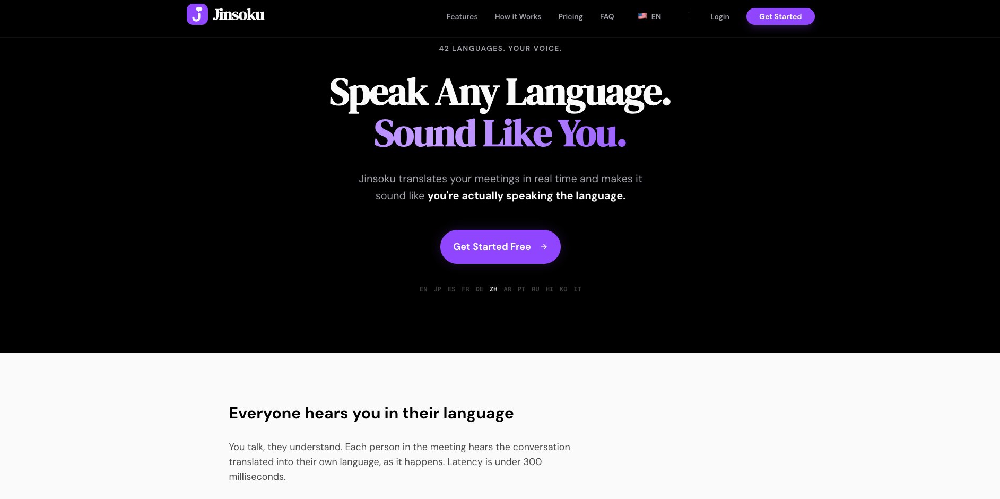
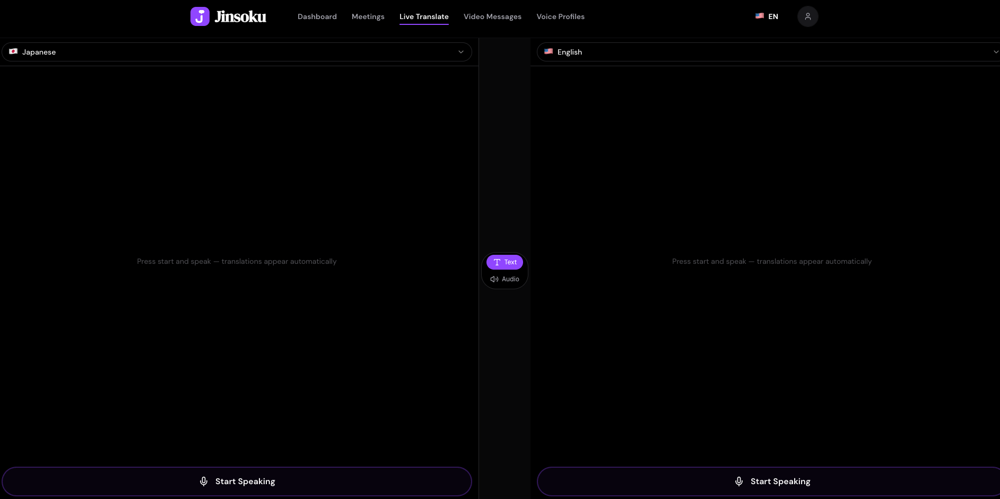
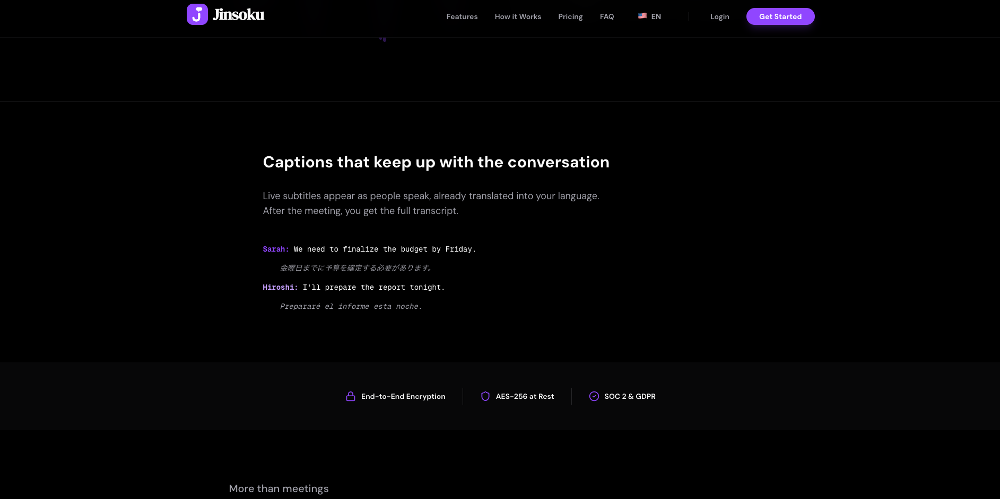
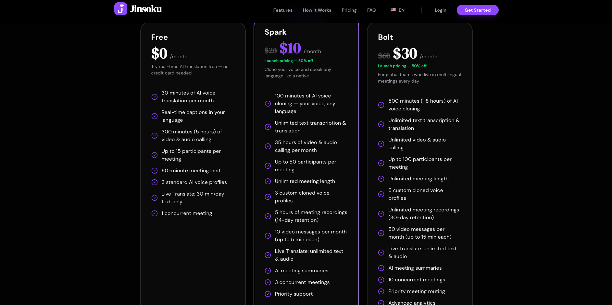
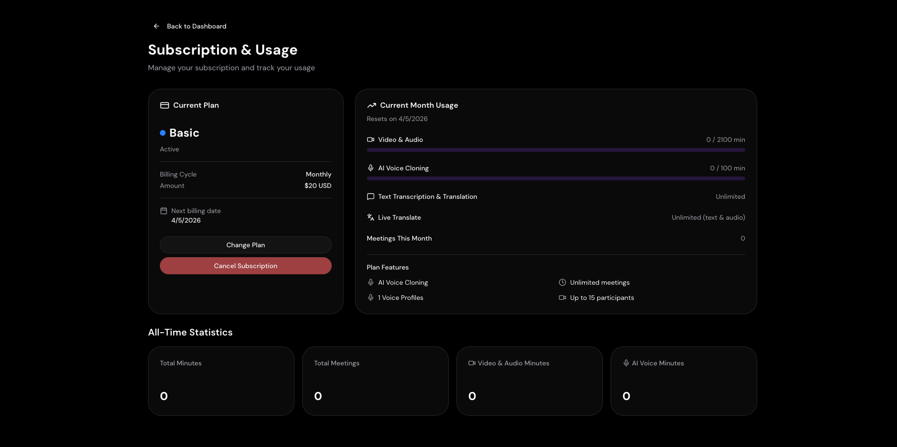

<p align="center">
  
</p>

<h1 align="center">Jinsoku</h1>

<p align="center">
  <strong>Speak Any Language. Sound Like You.</strong>
</p>

<p align="center">
  Real-time AI voice translation and voice cloning for multilingual meetings.<br />
  Sub-300ms latency. 42 languages. Your voice — in every language.
</p>

<p align="center">
  <a href="https://jinsoku.ai">Website</a> &nbsp;&bull;&nbsp;
  <a href="https://jinsoku.ai/#pricing">Pricing</a> &nbsp;&bull;&nbsp;
  <a href="#features">Features</a> &nbsp;&bull;&nbsp;
  <a href="#use-cases">Use Cases</a> &nbsp;&bull;&nbsp;
  <a href="#getting-started">Get Started</a>
</p>

<br />

<p align="center">
  
</p>

---

## The Problem

Global teams lose thousands of hours each year to language barriers. Existing solutions force you to choose: use a translation app *alongside* your video call, or settle for basic auto-captions that miss nuance and context.

**Jinsoku eliminates the gap.** Translation, transcription, and voice cloning are built directly into the meeting experience — not bolted on as an afterthought.

---

## Features

### Real-time Voice Translation
Speech-to-text with instant AI translation across **42 languages** — delivered in under **300 milliseconds**. Every participant hears the translated audio and sees captions in their preferred language as words are spoken.

<p align="center">
  
</p>

### AI Voice Cloning
Upload a **30-second audio sample** and Jinsoku creates a digital model of your voice that speaks any supported language. Participants hear *you*, not a robotic narrator — preserving your tone, cadence, and identity across every meeting.

### Live Captions & Text Translation
Live subtitles appear as people speak, already translated into your language. After the meeting, you get the full transcript.

<p align="center">
  
</p>

### HD Video & Audio Conferencing
Crystal-clear video and audio with adaptive bitrate streaming. Supports up to **100 participants** per meeting with enterprise-grade reliability and low latency worldwide.

### AI Meeting Summaries
Never take notes again. After every meeting, generate AI-powered summaries with **key points**, **action items**, and **decisions** — all extracted automatically from the conversation.

### Video Messages
Record and send translated video messages asynchronously. Perfect for cross-timezone teams — your message arrives in every recipient's language, in your voice.

### Meeting Recordings
Full recordings with baked-in captions and translations. Review any moment in any language after the meeting ends.

---

## How It Works

```
┌──────────────────────────────────────────────────────────────┐
│                        Meeting Room                          │
│                                                              │
│  Speaker (English) ──► Live Transcription ──► AI Translation │
│                                  │                 │         │
│                                  ▼                 ▼         │
│                           Live Captions    Voice Synthesis   │
│                         (each language)   (speaker's voice)  │
│                                                              │
│              ┌───────────────────────────────┐               │
│              │  Participant A hears: French  │               │
│              │  Participant B hears: Japanese│               │
│              │  Participant C hears: Spanish │               │
│              └───────────────────────────────┘               │
│                                                              │
│                    < 300ms end-to-end                         │
└──────────────────────────────────────────────────────────────┘
```

1. **Join a meeting** — create or join with a simple link
2. **Choose your language** — select from 42 supported languages
3. **Start talking** — Jinsoku handles translation in real time
4. **Review later** — AI summaries and recordings capture everything

---

## Use Cases

| Scenario | How Jinsoku Helps |
|---|---|
| **Global remote teams** | Daily standups where everyone speaks their native language and understands each other instantly |
| **International sales calls** | Close deals across borders without hiring interpreters or relying on broken machine translations |
| **International conferences** | Speakers present once — every attendee hears it in their language with the speaker's own voice |
| **Cross-timezone collaboration** | Send async video messages that auto-translate for recipients in different time zones |
| **Multilingual classrooms** | Students follow lectures in their own language with accurate, real-time captions |
| **Cross-border healthcare** | Doctors and patients communicate clearly — reducing errors from language gaps |

---

## Pricing

<p align="center">
  
</p>

| | **Free** | **Spark** | **Bolt** |
|---|:---:|:---:|:---:|
| **Price** | $0/mo | $10/mo | $30/mo |
| **Annual Price** | — | $100/yr | $300/yr |
| **Translation** | 30 min/mo | Included | Included |
| **Video & Audio** | 5 hrs/mo | 35 hrs/mo | Unlimited |
| **AI Voice Cloning** | — | 100 min/mo | 500 min/mo |
| **Participants** | 15 | 50 | 100 |
| **Meeting Duration** | 60 min | Unlimited | Unlimited |
| **AI Summaries** | — | Included | Included |
| **Concurrent Meetings** | 1 | Multiple | Multiple |

> Save **2 months free** with annual billing. 14-day money-back guarantee. No credit card required for Free tier.

<p align="center">
  <a href="https://jinsoku.ai/#pricing">
    <strong>View full pricing details →</strong>
  </a>
</p>

---

## Subscription & Usage Dashboard

Track your plan, usage, and meeting statistics all in one place.

<p align="center">
  
</p>

---

## Supported Languages

Jinsoku supports **42 languages** for transcription, translation, and voice synthesis — including:

`English` `Spanish` `French` `German` `Japanese` `Korean` `Mandarin` `Cantonese` `Portuguese` `Italian` `Russian` `Arabic` `Hindi` `Turkish` `Dutch` `Polish` `Swedish` `Thai` `Vietnamese` `Indonesian` `Malay` `Filipino` `Czech` `Danish` `Finnish` `Greek` `Hebrew` `Hungarian` `Norwegian` `Romanian` `Ukrainian` `Bengali` `Tamil` `Swahili` *and more...*

---

## Getting Started

1. **Visit [jinsoku.ai](https://jinsoku.ai)** and create a free account
2. **Set up your voice profile** — upload a 30-second audio sample for AI voice cloning
3. **Create a meeting** and share the link with participants
4. **Select languages** — each participant picks their preferred language
5. **Start talking** — translations appear and play back in real time

No downloads. No plugins. No credit card. Works in any modern browser.

---

## Security & Privacy

- **End-to-end encryption** on all video and audio streams
- **AES-256 encryption** for data at rest
- **SOC 2 & GDPR compliant** — audited security practices
- **No data selling** — your conversations are never used for training or sold to third parties
- **Data deletion on request** — full control over your information

---

## Performance

- **Sub-300ms latency** — from speech to translated audio playback
- **Adaptive streaming** — automatically adjusts quality based on network conditions
- **Global edge network** — low-latency connections from anywhere in the world
- **99.9% uptime** for paid plans

---

## Roadmap

We're actively building the future of multilingual communication:

- [x] Real-time transcription & translation (42 languages)
- [x] AI voice cloning with custom voice profiles
- [x] HD video & audio conferencing (up to 100 participants)
- [x] AI-powered meeting summaries
- [x] Live captions & text translation
- [x] Progressive Web App (installable on any device)
- [ ] Async video translation — record and auto-translate video messages
- [ ] Calendar integration — sync with Google Calendar and Outlook
- [ ] AI meeting assistant — context-aware bots that join and help

---

## FAQ

<details>
<summary><strong>How accurate is the translation?</strong></summary>
<br />
Jinsoku uses state-of-the-art neural machine translation models optimized for conversational speech. For major language pairs (English, Spanish, French, German, Japanese, etc.), quality is comparable to professional human translation for everyday business conversations.
</details>

<details>
<summary><strong>Does voice cloning sound natural?</strong></summary>
<br />
Yes. Upload just a 30-second audio sample and our AI creates a digital voice model that preserves your unique vocal characteristics — tone, pitch, cadence, and speaking style — across all 42 supported languages.
</details>

<details>
<summary><strong>How fast is the translation?</strong></summary>
<br />
Under 300 milliseconds from speech to translated audio playback. This is fast enough for natural, real-time conversation without awkward pauses.
</details>

<details>
<summary><strong>Is my data private?</strong></summary>
<br />
All streams are encrypted end-to-end with AES-256 at rest. We are SOC 2 and GDPR compliant. We never sell your data or use your conversations for AI training. You can request full data deletion at any time.
</details>

<details>
<summary><strong>Can I try it for free?</strong></summary>
<br />
Yes. The Free plan includes 30 minutes of translation and 5 hours of calling per month — no credit card required. Paid plans come with a 14-day money-back guarantee.
</details>

<details>
<summary><strong>Can I use Jinsoku for large meetings?</strong></summary>
<br />
The Bolt plan supports up to 100 participants per meeting with unlimited duration. For larger events, contact us for custom solutions.
</details>

---

## Reviews

<p align="center">
  <strong>4.9 / 5</strong> from 237 reviews
</p>

---

## Contact

- **Website**: [jinsoku.ai](https://jinsoku.ai)
- **Email**: support@jinsoku.ai

---

<p align="center">
  <sub>Built with purpose — making the world's conversations accessible to everyone.</sub>
</p>

<p align="center">
  <a href="https://jinsoku.ai">
    <strong>Try Jinsoku Free →</strong>
  </a>
</p>

<p align="center">
  <sub>&copy; 2025 Jinsoku. All rights reserved.</sub>
</p>
